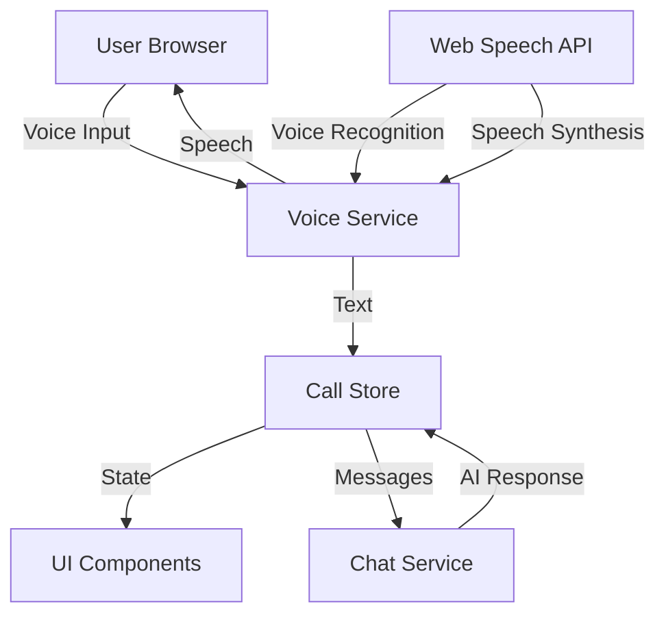
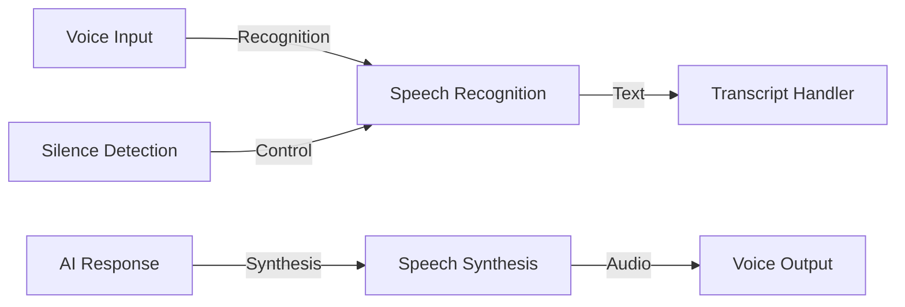
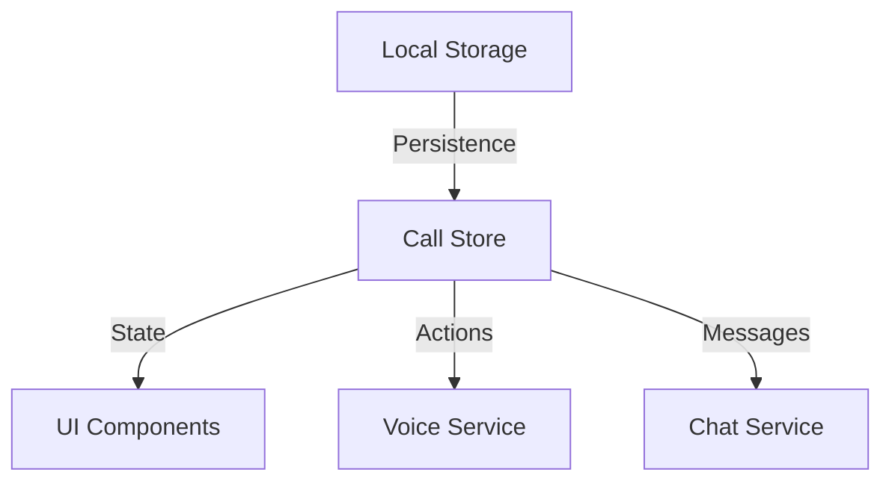
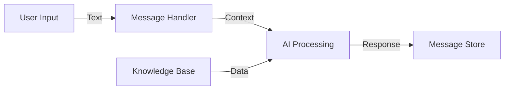
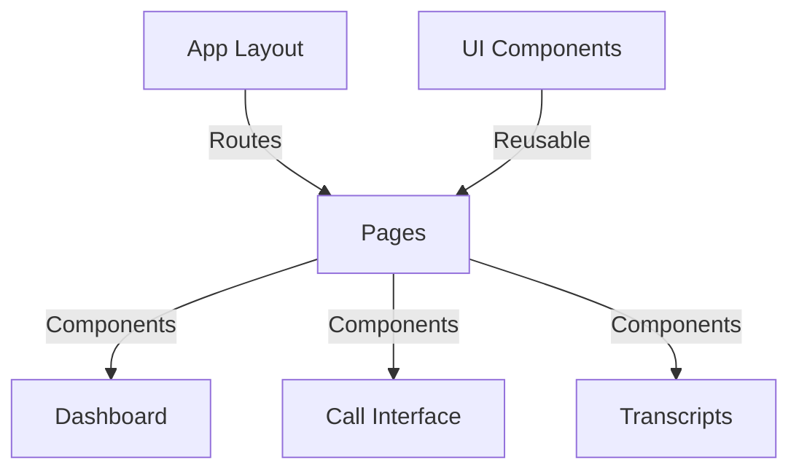
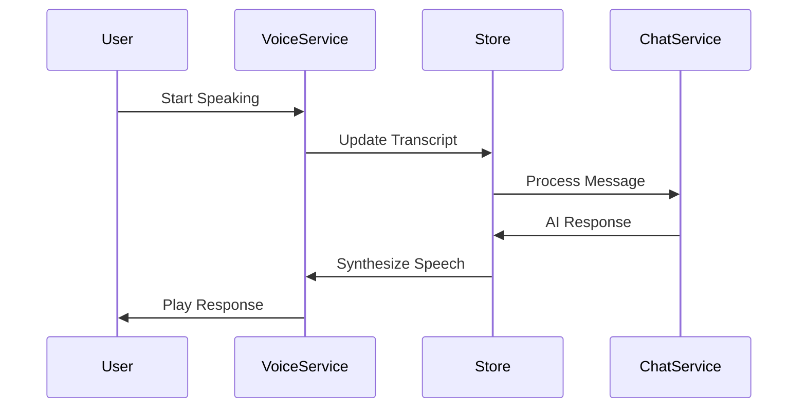
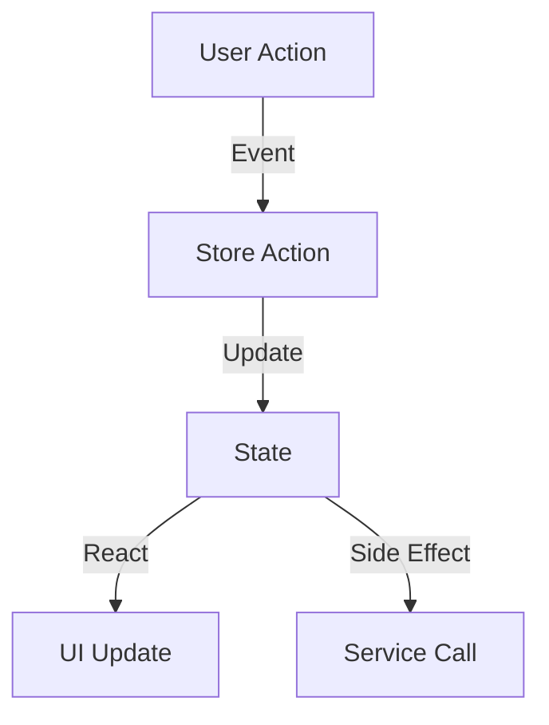
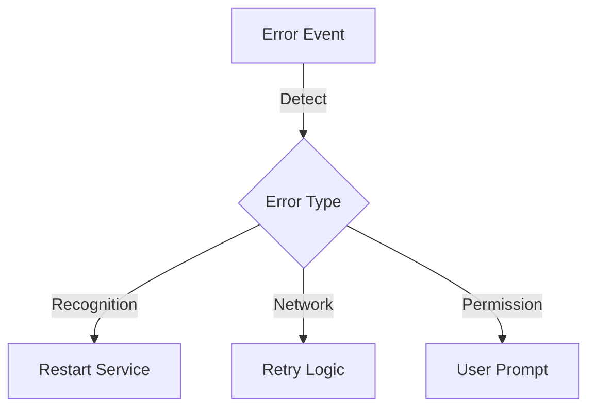
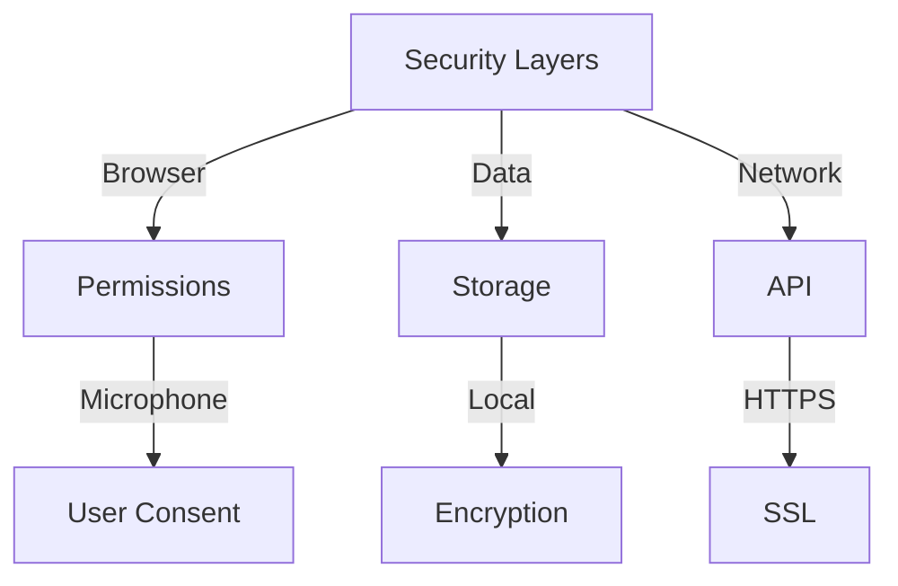
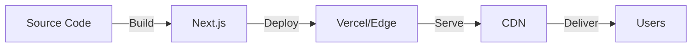

# AI Call Center Architecture

## System Overview

The AI Call Center is built on a modern, event-driven architecture that enables real-time voice communication between users and AI. Here's a high-level overview of the system:



## Core Components

### 1. Voice Service (`lib/voice-service.ts`)

Handles all voice-related functionality:



Key features:
- Real-time voice recognition
- Speech synthesis
- Silence detection
- Error recovery
- Voice quality optimization

### 2. State Management (`lib/store.ts`)

Centralized state management using Zustand:



State structure:
```typescript
interface CallState {
  calls: Record<string, Call>;
  activeCallId?: string;
  error: string | null;
  isListening: boolean;
  isSpeaking: boolean;
}
```

### 3. Chat Service (`lib/chat-service.ts`)

Manages AI conversation flow:



Features:
- Context management
- Response generation
- Knowledge base integration
- Conversation history

### 4. UI Architecture

Component hierarchy:



## Data Flow

### Call Lifecycle



### State Updates



## Technical Details

### Voice Processing Pipeline

1. **Input Processing**
   ```mermaid
   graph LR
       A[Microphone] -->|Raw Audio| B[Web Speech API]
       B -->|Text| C[Silence Detection]
       C -->|Processed Text| D[Store]
   ```

2. **Output Processing**
   ```mermaid
   graph LR
       A[AI Response] -->|Text| B[Speech Synthesis]
       B -->|Voice Selection| C[Audio Generation]
       C -->|Playback| D[Speakers]
   ```

### Error Handling



## Performance Optimizations

1. **Voice Processing**
   - Optimized silence detection
   - Efficient audio streaming
   - Smart restart mechanisms

2. **State Management**
   - Selective updates
   - Efficient data structures
   - Local storage caching

3. **UI Rendering**
   - Component memoization
   - Lazy loading
   - Virtual scrolling

## Security Considerations



## Deployment Architecture



## Future Considerations

1. **Scalability**
   - Multiple AI models
   - Concurrent call handling
   - Load balancing

2. **Features**
   - Multi-language support
   - Custom voice models
   - Advanced analytics

3. **Integration**
   - CRM systems
   - Analytics platforms
   - Third-party services 